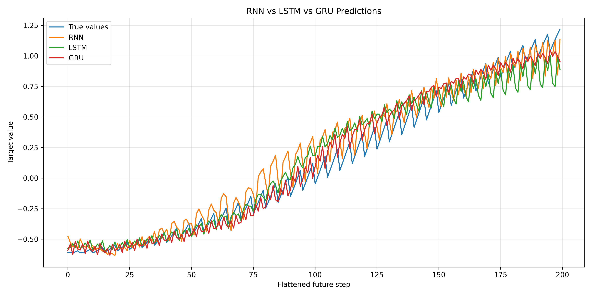

# ChemML：机器学习与 PyTorch 学习项目

本仓库用于整理我在机器学习、PyTorch以及化工与人工智能交叉方向学习过程中完成的代码和实验结果。

现阶段主要完成了：

- Python、NumPy与Pandas数据处理；
- PyTorch数据加载、模型训练、测试和保存；
- 多层感知机（MLP）回归；
- 卷积神经网络（CNN）图像分类；
- 循环神经网络（RNN、LSTM、GRU）序列建模；
- 反向传播与自动求导基础；
- 训练历史、预测结果和评价指标保存。

当前项目主要使用人工数据或公开入门数据集，目的是掌握神经网络基本结构和完整训练流程，为后续学习流程数据建模、流场预测以及计算流体力学与人工智能交叉研究做好准备。

---

## 仓库结构

```text
chemML/
├── README.md
├── requirements.txt
├── code/
│   ├── mlp_practice/
│   │   ├── 01_mlp_2d_function_prediction.py
│   │   ├── houseprice/
│   │   └── 2d/
│   ├── cnn_practice/
│   │   ├── 01_mnist_simple_cnn.py
│   │   ├── 02_mnist_deep_cnn.py
│   │   └── 03_cifar10_rgb_cnn.py
│   ├── rnn_practice/
│   │   ├── 01_basic_rnn_sine_prediction.py
│   │   ├── 02_rnn_sequence_classification.py
│   │   └── 03_compare_rnn_lstm_gru_multistep.py
│   └── autograd_and_backpropagation.md
```

---

## 项目概览

| 模块 | 项目 | 主要任务 | 主要知识 |
|---|---|---|---|
| MLP | 二维函数拟合 | 根据`x、y`预测`z` | 标准化、MLP回归、MAE、RMSE、R² |
| MLP | 模拟房价预测 | 根据面积、卧室数和房龄预测价格 | 多特征回归、DataLoader、模型保存 |
| CNN | MNIST简单CNN | 手写数字分类 | 卷积、ReLU、池化、全连接层 |
| CNN | MNIST深层CNN | 比较更深网络的分类能力 | 多层卷积、通道变化、参数量 |
| CNN | CIFAR-10分类 | 识别10类彩色图像 | 数据增强、BatchNorm、Dropout、早停 |
| RNN | 正弦序列预测 | 根据过去20步预测下一步 | 滑动窗口、隐藏状态、序列回归 |
| RNN | 波形序列分类 | 识别正弦波、方波和锯齿波 | 序列分类、logits、混淆矩阵 |
| RNN/LSTM/GRU | 多变量多步预测 | 根据三路传感器预测未来5步 | 多特征输入、梯度裁剪、模型比较 |

---

## 1. MLP多层感知机

目录：

[`code/mlp_practice`](code/mlp_practice)

### 二维函数拟合

代码：

[`01_mlp_2d_function_prediction.py`](code/mlp_practice/01_mlp_2d_function_prediction.py)

项目通过不同版本生成难度不同的二维函数数据，并使用MLP根据两个输入变量预测目标值。

主要内容：

- 模拟数据生成；
- CSV读取与保存；
- 训练集和测试集划分；
- 输入和目标标准化；
- `Dataset`与`DataLoader`；
- `nn.Linear`与ReLU；
- MSELoss与Adam；
- MAE、MSE、RMSE与R²；
- 模型保存；
- 新样本预测。

### 模拟房价预测

代码：

[`houseprice.py`](code/mlp_practice/houseprice/houseprice.py)

根据房屋面积、卧室数量和房龄预测模拟房价。

> 本项目的数据由程序人工生成，仅用于学习多特征回归流程，不代表真实房地产数据。

---

## 2. CNN卷积神经网络

目录：

[`code/cnn_practice`](code/cnn_practice)

包含三个递进项目：

1. MNIST简单CNN；
2. MNIST更深CNN；
3. CIFAR-10彩色图像分类。

主要学习内容：

- 图像张量`[batch, channel, height, width]`；
- 卷积层和卷积核；
- ReLU激活函数；
- 最大池化；
- 特征图和通道；
- 张量展平；
- 分类logits；
- CrossEntropyLoss；
- BatchNorm与Dropout；
- 数据增强；
- Adam与AdamW；
- Early Stopping；
- 学习率调度；
- 混淆矩阵和错误样本分析。

CIFAR-10项目当前保存的测试结果约为：

```text
测试准确率：86.58%
```

### CIFAR-10训练曲线


### CIFAR-10混淆矩阵


---

## 3. RNN、LSTM与GRU

目录：

[`code/rnn_practice`](code/rnn_practice)

包含三个递进项目：

### 基础RNN正弦序列预测

使用过去20个正弦函数值预测下一个值，主要学习滑动窗口、RNN三维输入、隐藏状态和序列回归。

### RNN波形分类

根据整段波形判断其属于正弦波、方波还是锯齿波，主要学习序列分类、最终隐藏状态、交叉熵损失和混淆矩阵。

### RNN、LSTM与GRU多步预测

使用三路传感器过去20个时间步的数据预测未来5个目标值，并比较三种循环网络的结果。

主要内容：

- 多变量时间序列；
- 多步预测；
- 时间顺序划分数据；
- 训练集标准化；
- Early Stopping；
- 学习率调度；
- 梯度裁剪；
- MAE与RMSE；
- 模型保存和加载。

### RNN、LSTM与GRU预测比较



---

## 已掌握的PyTorch基础流程

目前能够在参考相关资料和既有项目结构的情况下完成：

1. 生成或读取数据；
2. 构造输入特征和目标；
3. 划分训练集、验证集和测试集；
4. 数据标准化；
5. 创建Dataset与DataLoader；
6. 使用`nn.Module`定义模型；
7. 设置损失函数和优化器；
8. 进行前向传播与反向传播；
9. 完成模型训练、验证和测试；
10. 计算评价指标；
11. 保存和加载模型；
12. 保存训练历史和预测结果；
13. 对新样本进行预测。

目前仍需继续提高从空白文件独立设计项目、处理真实科研数据以及排查复杂程序问题的能力。

---

## 运行环境

建议使用：

```text
Python 3.10+
PyTorch
Torchvision
NumPy
Pandas
Matplotlib
Scikit-learn
```

安装依赖：

```bash
pip install -r requirements.txt
```

---

## 后续计划

- 继续提高PyTorch项目的独立编写和调试能力；
- 学习更规范的训练、验证和测试流程；
- 学习真实流程数据和流场数据的读取与预处理；
- 学习U-Net、ConvLSTM、注意力机制和Transformer；
- 阅读气固两相流、曳力模型及深度学习与计算流体力学交叉方向的论文；
- 结合实际课题完成一次完整的小规模科研实践。

---

## 项目说明

本仓库主要用于记录个人学习过程。

部分代码在学习过程中参考了PyTorch常见项目结构，并使用AI工具辅助进行解释、注释和错误排查。所有上传项目均由本人运行、修改和整理，并持续学习其中的数据流程、模型结构和训练原理。

目前仓库中的大部分数据属于人工数据或公开教学数据，尚不能直接代表真实化工科研或工业任务的最终结果。
