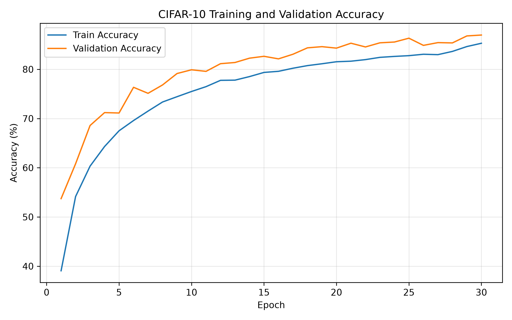
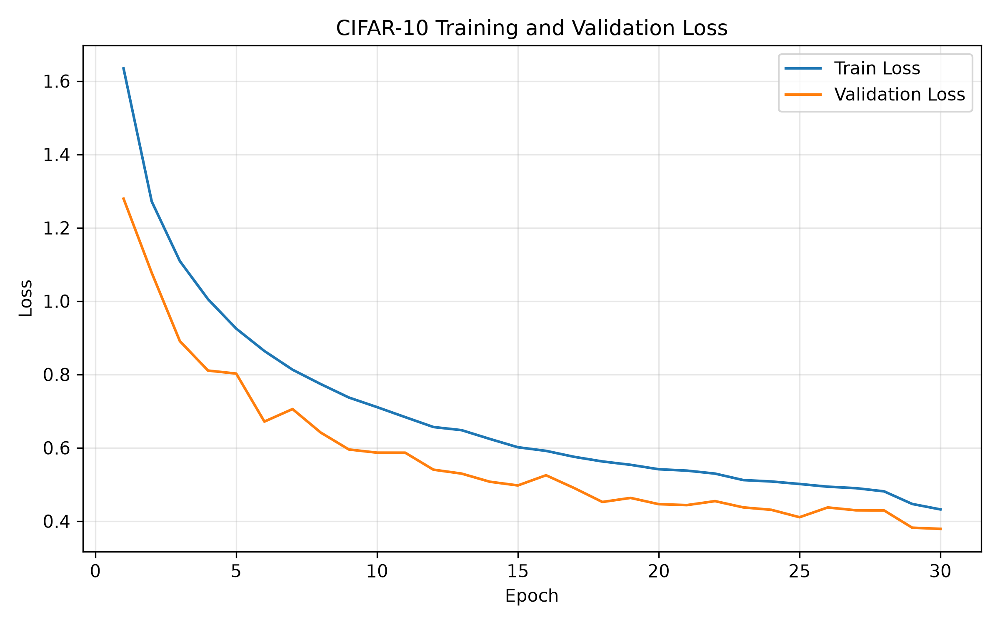
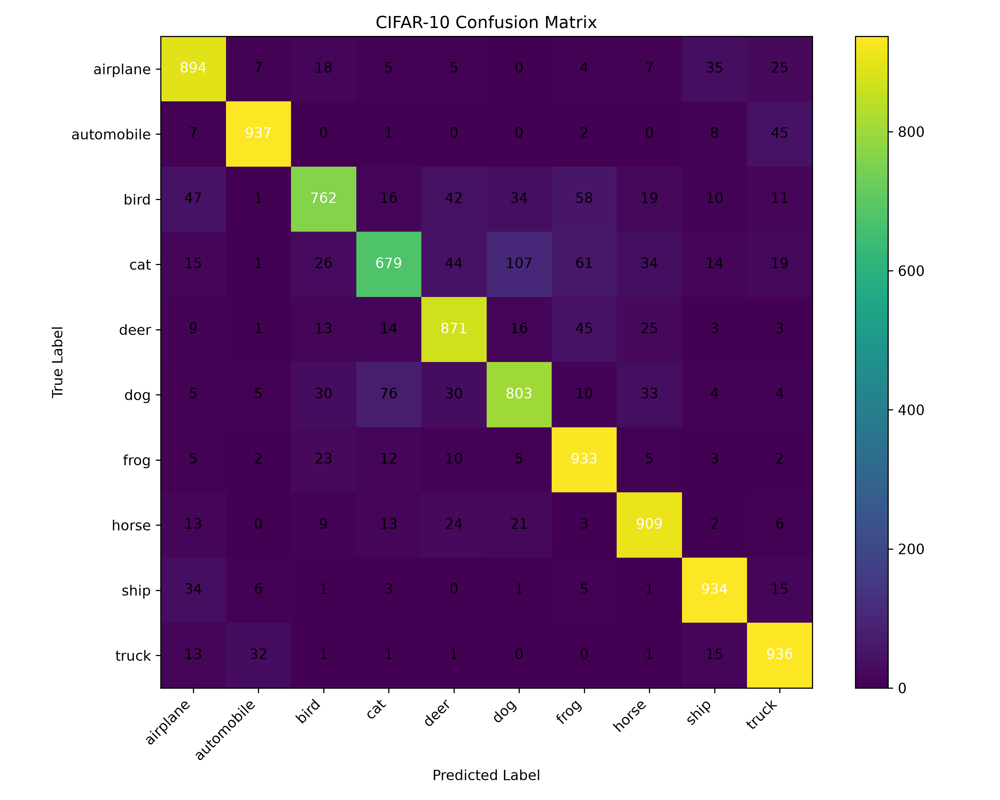

# CNN卷积神经网络分类练习

本目录记录使用PyTorch学习卷积神经网络的三个递进项目。

项目从MNIST灰度图像分类逐步扩展到CIFAR-10彩色图像分类，用于理解卷积、池化、通道、特征图以及完整图像分类流程。

---

## 文件说明

### `01_mnist_simple_cnn.py`

使用最基础的CNN识别MNIST手写数字。

模型结构：

```text
输入：[batch, 1, 28, 28]
↓
Conv2d：1 → 8通道
↓
ReLU
↓
MaxPool2d
↓
展平：[batch, 1568]
↓
Linear：1568 → 10
↓
输出10个类别分数
```

主要学习内容：

- 灰度图像；
- 单通道输入；
- 卷积层；
- ReLU；
- 最大池化；
- 张量展平；
- 分类logits；
- CrossEntropyLoss；
- Adam；
- 测试准确率；
- 模型保存。

---

### `02_mnist_deep_cnn.py`

在基础模型上增加卷积层和通道数量，用于观察网络深度和参数量的变化。

模型结构：

```text
输入：[batch, 1, 28, 28]
↓
Conv2d：1 → 32
↓
Conv2d：32 → 64
↓
MaxPool2d
↓
Conv2d：64 → 128
↓
MaxPool2d
↓
展平
↓
Linear：128 × 7 × 7 → 10
```

主要学习内容：

- 多层卷积；
- 通道数量变化；
- 多次池化；
- 网络深度；
- 参数量统计；
- 简单CNN与更深CNN比较。

---

### `03_cifar10_rgb_cnn.py`

使用较完整的CNN对CIFAR-10彩色图像进行分类。

主要学习内容：

- RGB三通道输入；
- 随机裁剪；
- 随机水平翻转；
- 训练集、验证集和测试集；
- BatchNorm；
- Dropout；
- Adaptive Average Pooling；
- AdamW；
- 学习率调度；
- Early Stopping；
- 最佳模型保存；
- 混淆矩阵；
- 分类别准确率；
- 错误预测样本分析。

---

## 当前结果

| 项目 | 当前结果 |
|---|---:|
| MNIST简单CNN | 请填写实际运行结果 |
| MNIST更深CNN | 请填写实际运行结果 |
| CIFAR-10 CNN | 86.58% |

不要仅根据记忆填写MNIST准确率，建议重新运行一次后，把终端结果记录到这里。

---

## 输出结果

```text
outputs/
├── prediction.png
├── deep_prediction.png
├── class_accuracy.csv
├── training_history.csv
└── figures/
    ├── loss_curve.png
    ├── accuracy_curve.png
    ├── confusion_matrix.png
    └── misclassified_examples.png
```

### CIFAR-10准确率曲线



### CIFAR-10损失曲线



### CIFAR-10混淆矩阵



---

## 当前不足

- MNIST项目没有单独划分验证集；
- MNIST结果尚未保存为CSV或Markdown；
- CIFAR-10模型仍属于自行搭建的基础网络；
- 尚未比较ResNet等成熟网络；
- 尚未处理真实科研图像或流场数据；
- 部分训练代码可以进一步拆分为函数。

---

## 后续改进

- 为MNIST增加验证集；
- 保存每个epoch的损失和准确率；
- 统一三个项目的输出目录；
- 比较简单CNN、深层CNN和ResNet；
- 学习U-Net并尝试二维场预测任务。
