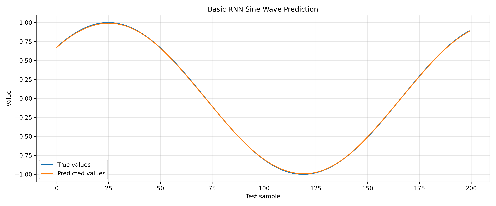
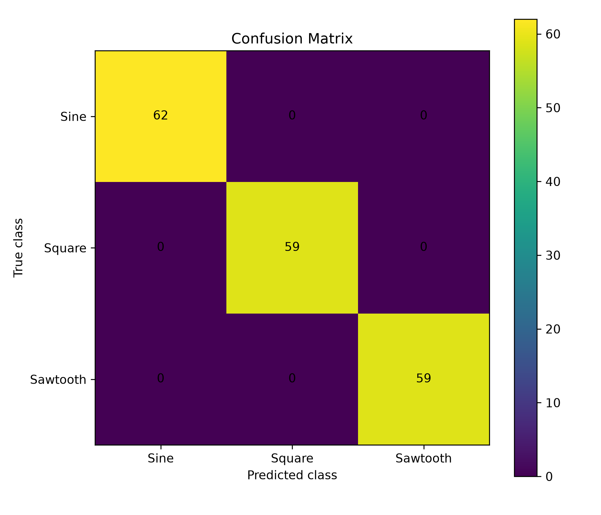

# RNN、LSTM与GRU序列建模练习

本目录记录使用PyTorch学习循环神经网络的三个递进项目。

学习内容从单变量单步预测，逐步扩展到序列分类、多变量输入、多步预测，以及RNN、LSTM和GRU的比较。

---

## 1. 基础RNN正弦序列预测

文件：

```text
01_basic_rnn_sine_prediction.py
```

任务：

使用过去连续20个正弦函数值预测下一个数值。

主要学习内容：

- 时间序列；
- 滑动窗口；
- RNN三维输入；
- `[batch, sequence, feature]`；
- `nn.RNN`；
- `output`与`h_n`；
- 最后一个时间步；
- MSE、MAE和RMSE；
- 模型保存；
- 真实值与预测值曲线。



---

## 2. RNN波形序列分类

文件：

```text
02_rnn_sequence_classification.py
```

任务：

根据一整段波形判断其属于：

- 正弦波；
- 方波；
- 锯齿波。

主要学习内容：

- many-to-one序列分类；
- 最终隐藏状态；
- logits；
- CrossEntropyLoss；
- 训练集、验证集和测试集；
- Early Stopping；
- 混淆矩阵；
- 模型保存和重新加载；
- 新样本概率预测。



---

## 3. RNN、LSTM与GRU多步预测

文件：

```text
03_compare_rnn_lstm_gru_multistep.py
```

任务：

使用三路传感器过去20个时间步的数据，预测未来5个目标值，并比较RNN、LSTM和GRU的表现。

主要学习内容：

- 多变量时间序列；
- 多特征输入；
- 多步预测；
- RNN、LSTM和GRU统一接口；
- LSTM隐藏状态和细胞状态；
- 时间顺序划分数据；
- 避免未来信息泄漏；
- 输入和目标标准化；
- AdamW；
- ReduceLROnPlateau；
- Early Stopping；
- 梯度裁剪；
- MAE和RMSE；
- 模型保存、加载和新样本预测。


---

## RNN、LSTM和GRU的基本区别

### RNN

结构最简单，通过隐藏状态传递历史信息，但在较长序列中可能出现梯度消失和长期信息丢失。

### LSTM

增加细胞状态和门控机制，能够更好地保留长期信息。

### GRU

同样具有门控结构，但结构通常比LSTM更简单，参数量相对较少。

---

## 当前不足

- 当前序列均由程序人工生成；
- 尚未使用真实传感器或流程数据；
- 尚未进行多次随机重复实验；
- 三种模型的超参数没有进行全面搜索；
- 基础RNN项目尚未单独划分验证集；
- 尚未比较注意力机制和Transformer。

---

## 后续改进

- 使用真实过程传感器数据；
- 增加缺失值、异常值和噪声处理；
- 使用验证集选择最佳模型；
- 增加多次重复实验和结果统计；
- 学习ConvLSTM；
- 学习注意力机制与时间序列Transformer。
